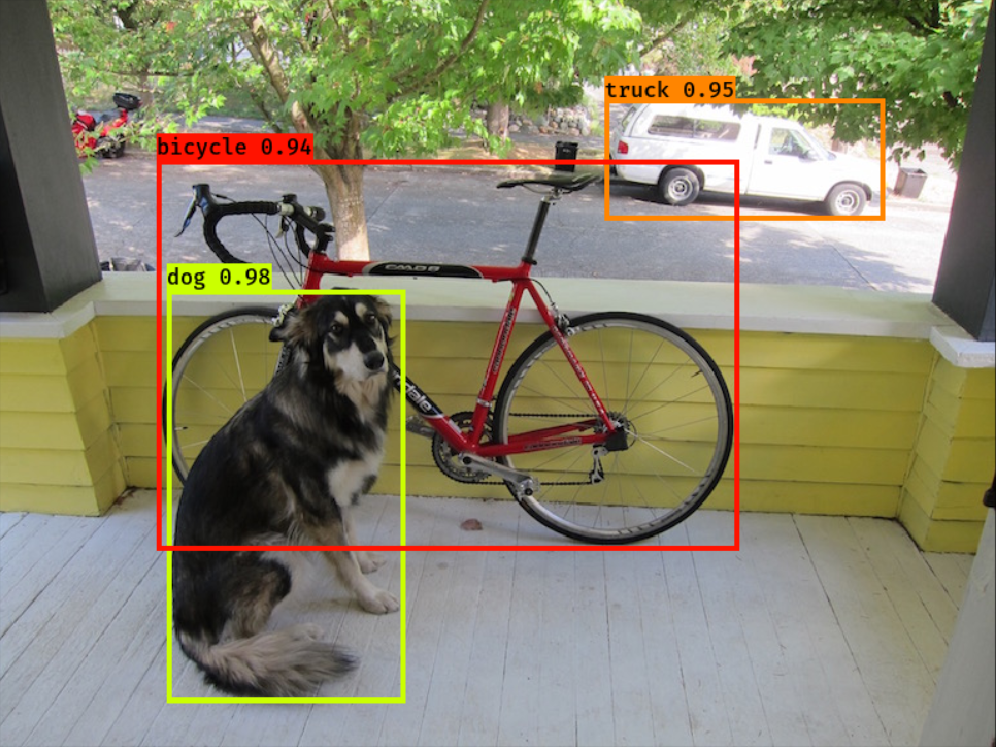

# keras-yolo4

[](LICENSE)

## Introduction

A Keras implementation of YOLOv4 (Tensorflow backend) inspired by [https://github.com/AlexeyAB/darknet](https://github.com/AlexeyAB/darknet).

Frame code from [https://github.com/qqwweee/keras-yolo3](https://github.com/qqwweee/keras-yolo3).



---

## Quick Start

1. Download YOLOv4 weights from [yolov4.weights](https://drive.google.com/open?id=1cewMfusmPjYWbrnuJRuKhPMwRe_b9PaT).
2. Convert the Darknet YOLOv4 model to a Keras model.
3. Run YOLOv4 detection.

```
python convert.py
```

Running convert.py will get keras yolov4 weight file yolo4_weight.h5.


### Usage

Inference

```
python test.py
```
---

### Todo

Debug train code with CIoU loss. Loss code from [https://github.com/david8862/keras-YOLOv3-model-set](https://github.com/david8862/keras-YOLOv3-model-set).
